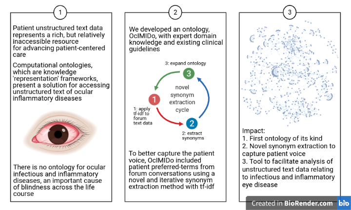

# OcIMIDo Documentation

[Home](README.md) | [Documentation](MIRO.md) | [License](LICENSE.md) | [Changelog](CHANGELOG.md) | [Manuscript](https://doi.org/10.1016/j.compbiomed.2021.104542) | [Bioportal](https://bioportal.bioontology.org/ontologies/OCIMIDO)

## Home

## Creators

* [Samantha Pendleton](https://twitter.com/sap218) Institute of Cancer and Genomic Sciences, University of Birmingham, UK
* [Tasanee Braithwaite](https://twitter.com/tasbraithwaite) The Medical Eye Unit, St Thomas’ Hospital NHS Foundation Trust, London UK

## About



Uveitis, and other ocular immune-mediated inflammatory eye diseases (IMIDs) are not fully represented in clinical practice. Current biomedical ontologies and medical terminologies are not fully expressing our domain of interest.

The patient voice is a valuable resource for advancing patient care, however text mining efforts for patient unstructured text is difficult as they contain patient-preferred terms, rather than formal clinical terms. To gain a better understanding of the patient voice in ocular IMIDs, and to overcome text mining efforts, we proposed the development of an ontology to address the challenge presented by unstructured text data. 

We initially designed an ontology with clinical guidelines, expert domain knowledge, and included relevant classes. OcIMIDo is the first ontology of its kind in ophthalmology, which includes associated diseases, complications, medical therapies, and much more.

We extracted forum conversation from UK-based [Olivia’s Vision](http://oliviasvision.org) and split the data into training/testing, with the training we used a novel synonym extraction method (tf-idf), which ranks every term in order of importance. Our domain expert manually matched them to OcIMIDo terms - after the first round of tf-idf, we removed OcIMIDo terms from the forum, and re-ran. We did this until no more synonyms could be added to OcIMIDo.

For validation, we annotated term frequency in the forum test set to ensure we didn’t miss any synonyms - also observing term frequency. Additionally had two other domain experts manually annotate the forum conversation for comparison, showing the tf-idf curation was much more time-efficient.

Using both clinical & patient-preferred terms, our text mining efforts were increased: e.g. using “methotrexate” with patient-preferred terms: “mtx”, “mxt” (a common misspelling based on ranking), and “amethopterin” increased the post count by 80%, from 185 to 333. Futhermore, we extracted another forum, USA-based [Uveitis Foundation](https://uveitis.org) and observed terms in this forum were location-specific, e.g. US-based medications.

The increase in text mining efforts facilitates sentiment analysis for capturing the patient's voice, we used pretrained models TextBlob and VADER. Sentiment analysis revealed that first posts were significantly more negative than replies, providing insight into the supportive role that online fora play for patients and their carers.

### Citing

```
@article{PENDLETON2021104542,
title = {Development and application of the ocular immune-mediated inflammatory diseases ontology enhanced with synonyms from online patient support forum conversation},
journal = {Computers in Biology and Medicine},
volume = {135},
pages = {104542},
year = {2021},
issn = {0010-4825},
doi = {https://doi.org/10.1016/j.compbiomed.2021.104542},
url = {https://www.sciencedirect.com/science/article/pii/S001048252100336X},
author = {Samantha C. Pendleton and Luke T. Slater and Andreas Karwath and Rose M. Gilbert and Nicola Davis and Konrad Pesudovs and Xiaoxuan Liu and Alastair K. Denniston and Georgios V. Gkoutos and Tasanee Braithwaite},
}
```

